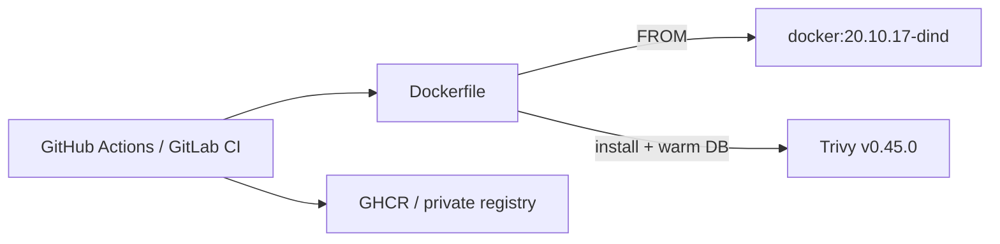

# DinD + Trivy image

[](https://github.com/maxuver/dind-trivy-image/actions/workflows/ci.yml)
[](LICENSE)

A Docker-in-Docker image with Trivy pre-installed and CVE databases
pre-warmed at build time. Designed to be the base image for a **single-job**
CI pipeline that does `build → scan → push` without per-run DB downloads.

## Why

A typical pipeline runs three separate jobs:
```
.docker_build → .scan_image → .docker_push
```

This leaves a window where an unscanned image is already pushed, burns CI
minutes across three runners, and re-downloads the Trivy DBs on every job.

With this image:
```
.docker_build_scan_push   # single job, single context
```

The image has the DBs baked in, so `trivy image` starts instantly.

## Architecture



## Build

```bash
docker build \
  --build-arg DOCKER_VERSION=20.10.17 \
  --build-arg TRIVY_VERSION=0.45.0 \
  -t ghcr.io/maxuver/dind-trivy:latest .
```

The included GitHub Actions workflow builds and pushes to **GHCR** on every push to `main`/`master`.

## Use in CI

```yaml
build_scan_push:
  image: ghcr.io/maxuver/dind-trivy:latest
  services:
    - docker:20.10.17-dind
  script:
    - docker build -t myapp:$SHA .
    - trivy image --exit-code 1 --severity HIGH,CRITICAL myapp:$SHA
    - docker push myapp:$SHA
```

## License

MIT — see [LICENSE](LICENSE).
